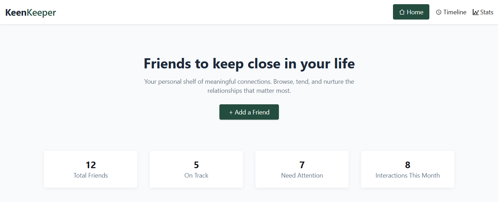
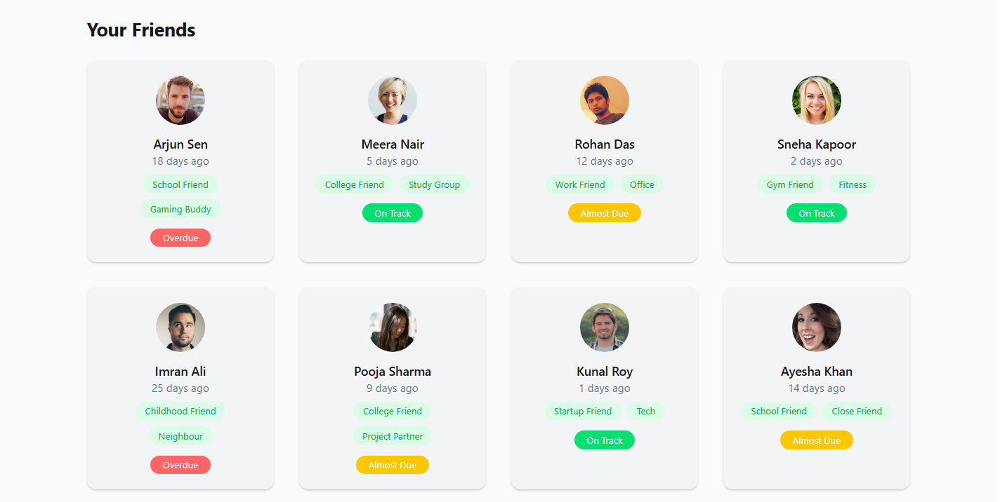
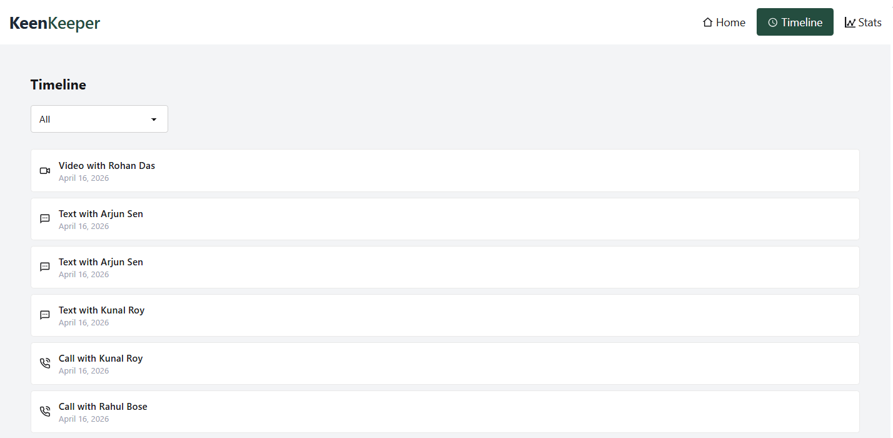
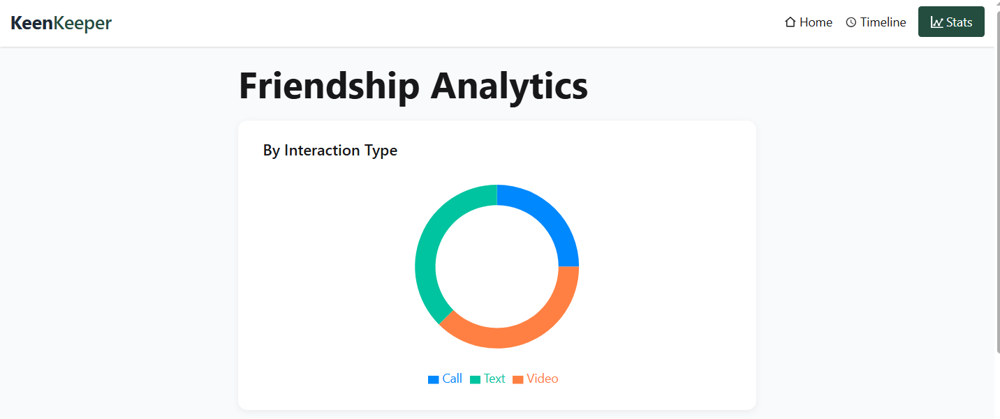
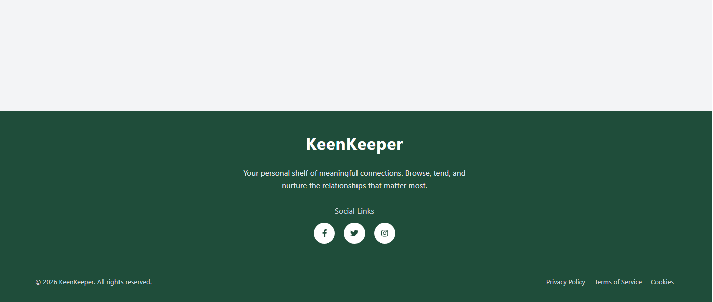

# 👥 Keen Keeper

### 💙 Stay connected. Never lose touch.

Track your friendships, log meaningful interactions, and visualize your relationship journey — all in one place. Build stronger connections by staying consistent and mindful.

 

  

<a href="https://nabdip-keen-keeper.netlify.app/" target="_blank" style="
  background: linear-gradient(135deg, #0ea5e9, #6366f1);
  color:white;
  padding:12px 22px;
  border-radius:10px;
  text-decoration:none;
  display:inline-block;
  margin:5px;
">
  🌐 Live Project
</a>

<a href="https://github.com/Nabdip-Dev/A7-keen-keeper" target="_blank" style="
  background:#111827;
  color:white;
  padding:12px 22px;
  border-radius:10px;
  text-decoration:none;
  display:inline-block;
  margin:5px;
">
  💻 Source Code
</a>

---

## 🧩 Core Features

* 👥 Manage all your friends easily
* 📞 Track calls, messages & interactions
* 📊 Visual analytics dashboard
* ⏳ Timeline of your friendships

---

## 🖼️ Web Preview

 

---

## ⚡ Why This Web?

Friendships don’t fade overnight — they fade when we stop paying attention.

Keen Keeper helps you stay intentional about your relationships by reminding you to connect, track, and care. Whether it’s a quick call or a meaningful conversation, every interaction matters.

---

## 🛠️ Tech Stack

---

## 💬 Philosophy

> “Friendship is not about time, it’s about consistency.”

---

🚀 Explore the Live App  
⭐ Star the repo if you find it useful

